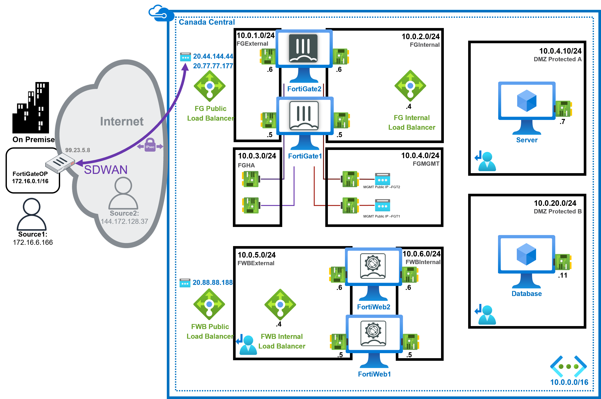
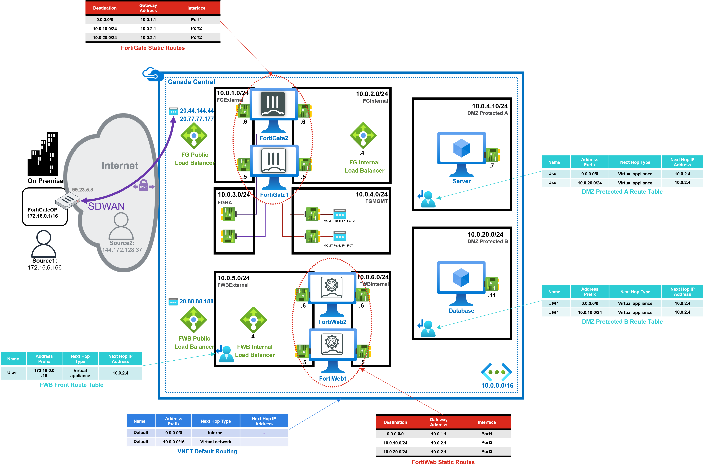
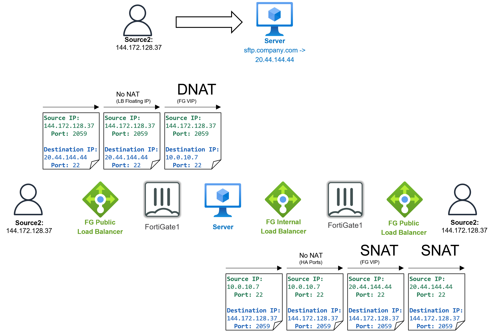
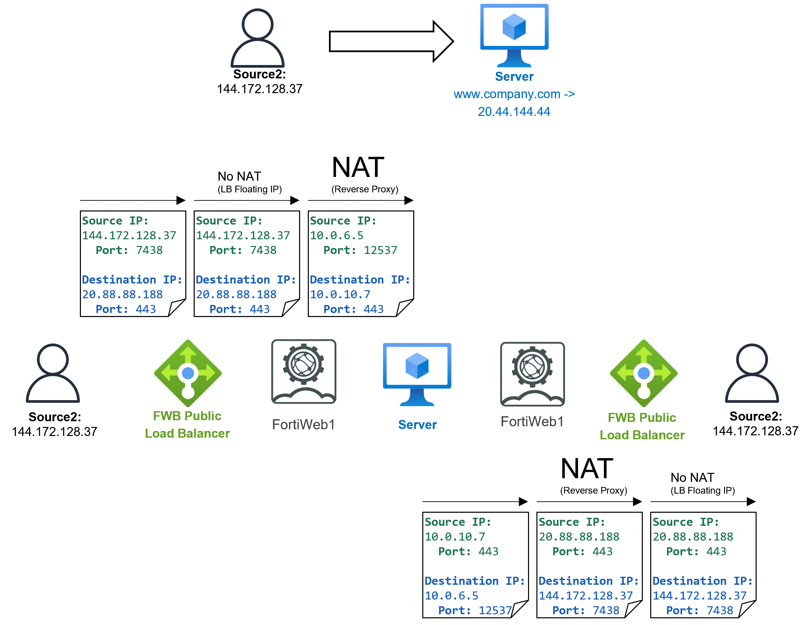
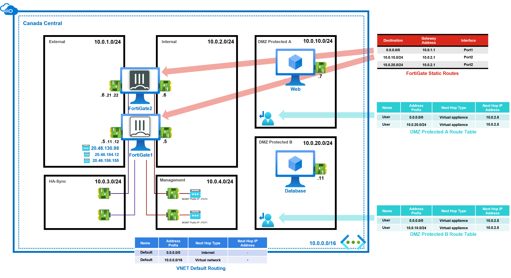

# Fortinet Reference Architecture for Azure

## Considerations and Justifications

!!! note ""
    - **FortiWeb** is primarily designed for web traffic, specifically HTTP/HTTPS, and offers 60+ protections including **machine learning** and **signature-based protections**.

    - **FortiGate** is designed for managing all other types of traffic, supporting multiple protocols, and providing **application control** and **intrusion prevention systems**.

??? note "WAF Feature Comparison: FortiWeb vs. FortiGate"
    | Feature                                  | FortiGate                            | FortiWeb                                                |
    |------------------------------------------|--------------------------------------|---------------------------------------------------------|
    | Web App Attack Signatures                | Yes | Yes                    |
    | WAF Signatures (FortiGuard Subscription) | No    | Yes                    |
    | IP Reputation (FortiGuard subscription)  | Yes | Yes                    |
    | Layer 7 DoS Protection                   | Yes | Yes (+ Bot validation) |
    | Machine Learning based Anomaly Detection | No    | Yes                    |
    | Machine Learning based Bot Mitigation    | No    | Yes                    |
    | Machine Learning based API Protections   | No    | Yes                    |
    | HTTP RFC Validation                      | Yes | Yes                    |
    | API Protection                           | No    | Yes                    |
    | Cookie Protection, CSRF                  | No    | Yes                    |
    | Browser Security (Man-in-the-Browser)    | No    | Yes                    |
    | Syntax based detection                   | No    | Yes                    |
    | Antivirus/Antimalware                    | Yes | Yes                    |
    | Web App Attack Correlation               | No    | Yes                    |
    | Web App Vulnerability Scanner            | No    | Yes                    |
    | Web Filtering                            | Yes | No                       |
    | Data Leak Prevention                     | Yes | Yes                    |
    | Attack Alert Tuning                      | No    | Yes                    |
    | Web Defacement Protection                | No    | Yes                    |
    | Authentication Offload                   | Yes | Yes                    |
    | Site Publishing and SSO                  | SSO                                  | Yes                    |
    | PCI Compliance                           | Yes | Yes                    |
    | Dedicated WAF Throughput                 | No    | Yes                    |
    | SSL Inspection                           | Yes | Yes                    |

## FortiWeb Reference Architecture

???+ note "High-Level View"
    Click on the image if you want to enlarge it.

    

??? note "Detailed View"
    

??? note "Detailed View with Routes"
    

??? note "Internet originating Non-HTTP(S) flows (i.e. SSH etc…)"
    

??? note "Internet originating HTTP(S) flows"
    

??? note "Internal originating Non-HTTP(S) flows (i.e. SSH etc…)"
    

??? note "Internal originating HTTP(S) flows"
    

## FortiGate Reference Architecture

### FortiGate-VM – Active-Passive with Fabric connector

!!! example ""

    **Strengths**

      - Failover of existing connections
      - Support of non-TCP/UDP protocols (e.g. ESP, ICMP)
      - Source IP of connections that ingress from the Internet is not modifed

    **Weaknesses**

      - Failover time is dependent on Azure API response time and can vary from approximtely 45 seconds to up to more than 2 minutes
      - As with all active-passive designs, the passive node is not passing traffic in the majority of times

    **Uses**

      - Architectures requring IPSEC VPN with NAT-T suppert (like IOT or other non-FortiGate IPSEC termination)

??? note "High-Level View"
    

??? note "Detailed View"
    **FortiGate1 is Active**
    

### FortiGate-VM – Active-Passive with Load Balancers

!!! example ""

    **Strangths**

      - Relatively fist fial over (10 to 20 seconds on average)
      - Source IP of connections that ingres from Intern0t is not madified

    **Weaknesses**

      - Existing establshed connections are not failed over(Azure Load Balancer limitation)
      - Only supports UDP or TCP connections (Azoure Load Balancer limitation)
      - As with all active-passive designs, the passive node is not passing traffic in the majerity of times

    **Uses**

      - Fortinet Azure SDWAN hub

??? note "High-Level View"
    

??? note "Detailed View"
    

### FortiGate-VM – Active-Active with Load Balancers

!!! example ""

    **Strengths**

      - Relatively fast fail over (10 to 20 seconds on average)
      - Both firewall VMs are processing traffic during normal operations

    **Weaknesses**

      - Existing established cannections are not failed over(Azure Load Balancer limitation)
      - Only supports UDP or TCP connections (Azure Lead Balancer limitation)
      - Source IP of connections that ingress from Internet is oftan modified with Source NAT

    **Uses**

      - Recommended Architecture

??? note "High-Level View"
    

??? note "Detailed View"
    **Multiple Public IPs**
    

### Azure Gateway Load Balancer and FortiGate

!!! example ""
    - The integration of Fortinet FortiGate Next-Generation Firewall (NGFW) with Azure Gateway Load Balancer (GWLB) simplifies deployment and configuration while reducing outages.
    - The Azure GWLB supports service chaining to enable transparent deployment of firewall NVAs without introducing management overhead.
    - It uses the VXLAN protocol for encapsulation and decapsulation, maintaining flow symmetry for traffic inspection by firewall NVAs.

??? note "Reference Architecture"
    **Consumer Load  Balancer Frontend Public IP**
    

## Frequently Asked Questions

!!! note ""
    **Q – Does this apply to other Public Clouds ?**

    A – This Architecture is specific to Azure.

    ---

    **Q – Why are the FortiWeb VMs and FortiGate VMs in parallel instead of series for Internet web flows?**

    A – FortiWeb has integrated IPS and AV thus no need to duplicate on FortiGate using up cloud computing cycles.

    ---

    **Q – Why is the FWB Internal LB in the FWBExternal Subnet and not the FWBInternal Subnet?**

    A – Because it is used only for traffic passing through SDWAN.

    ---

    **Q – Why is there no Azure Internal LB in the FWBInternal subnet**

    A – FortiWeb can only be deployed in reversed proxy in Azure and thus the traffic replies automatically go back to the appropriate FortiWeb VM thus negating the needs to have Azure Internal Load Balancer in HA Ports.
