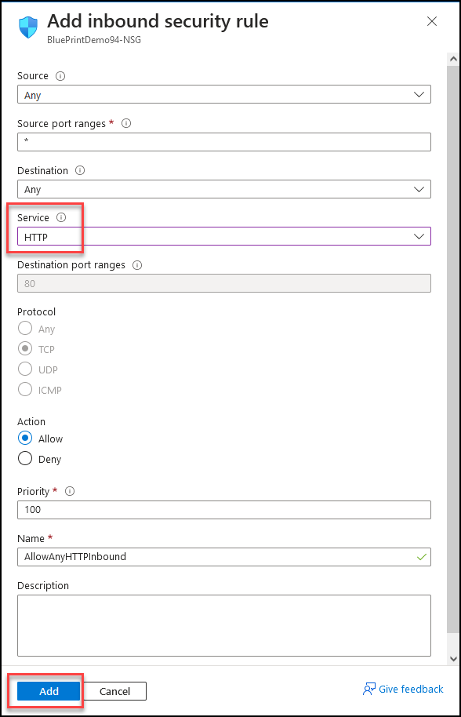
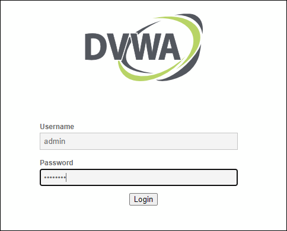
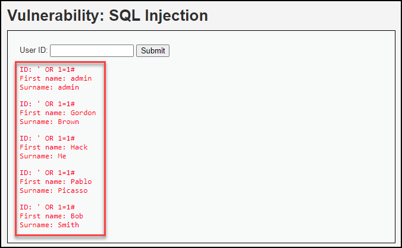
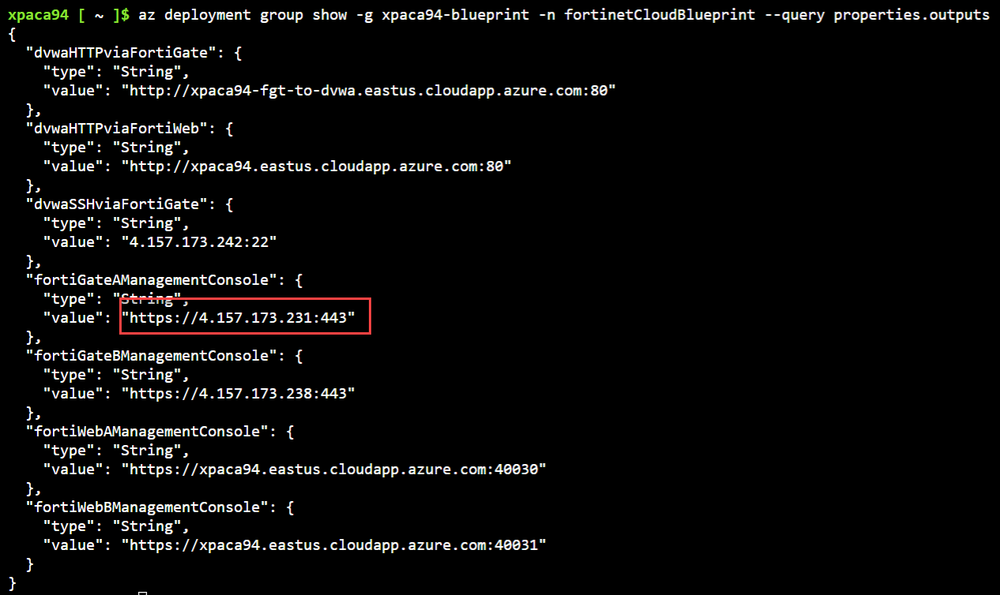
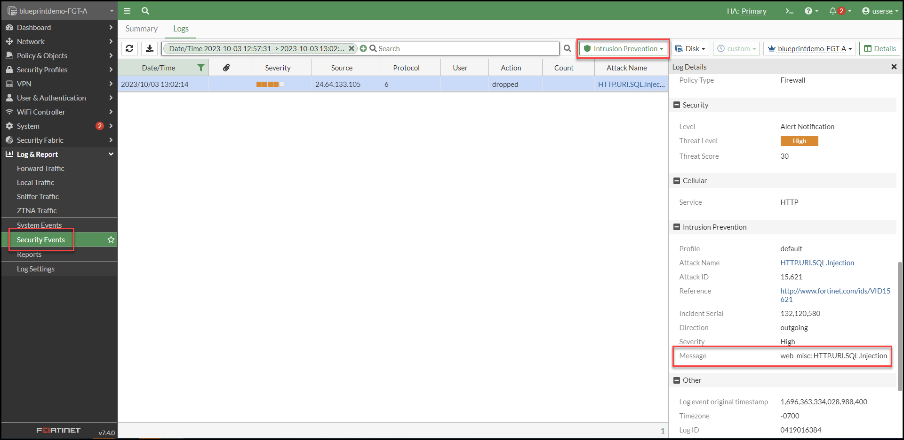

# Protecting Web Application Using Azure Network Security Groups and FortiGate

## Accessing DVWA via NSG's

The first step in this exercise will be to create a Network Security Group and associate it to the subnet where the DVWA instance is deployed.

!!! tip
    Click on the images to view them in a larger format.

??? note "Creating a Network Security Group"
    In the search bar type **Network Security Groups**, and select the non-classic option.

    

    Create a new Security Group.
    
    
    
    Select the Resource Group **@RESOURCE_GROUP_NAME** and give the Network Security Group a **unique name**.
    
    **Review +Create** the Resource.

    

    Once created, Click on **Go to Resource** to be redirected to your newly created NSG.

    

    Navigate to the **Inbound Security Rules** menu Item.

    

    Create new entries to allow **HTTP, HTTPS, SSH** services from any sources.

    | AllowAnyHTTPInbound                                                                                                    | AllowAnyHTTPSInbound                                                                                                    | AllowAnySSHInbound                                                                                                    |
    |------------------------------------------------------------------------------------------------------------------------|-------------------------------------------------------------------------------------------------------------------------|-----------------------------------------------------------------------------------------------------------------------|
    | **Source** = Any <br> **Source Port** = Any <br> **Destination** = Any <br> **Service** = HTTP <br> **Action** = Allow | **Source** = Any <br> **Source Port** = Any <br> **Destination** = Any <br> **Service** = HTTPS <br> **Action** = Allow | **Source** = Any <br> **Source Port** = Any <br> **Destination** = Any <br> **Service** = SSH <br> **Action** = Allow |

    

    Once you've created the corresponding rules, you'll see your rules, in addition to the rules Azure had implicitely configured:

    

    Navigate to the **Subnets** menu and **Associate** the Network security group to the **DMZProtectedA**  Subnet.

    

    

??? note "Testing your Network Security Group"
    In Azure CLI, print your deployment **Outputs** and click on <a href="http://@PREFIX-fgt-to-dvwa.@REGION.cloudapp.azure.com" target="_blank">http://@PREFIX-fgt-to-dvwa.@REGION.cloudapp.azure.com</a>

    ``` py
    az deployment group show -g @RESOURCE_GROUP_NAME -n fortinetCloudBlueprint --query properties.outputs
    ```

    

    Log in to DVWA using the credentials **admin** and **password**.

    

    Navigate to the **SQL Injection** menu item and type:

    ```
    ' OR 1=1#
    ```

    

    Notice the attack was not prevented.
    
    
    
    **Why?** After the NSG permitted access to the DVWA Workload on Port 80 (HTTP) no subsequent inspection occured.

## Accessing DVWA via FortiGate

Now, we will execute the same attack, but this time, we will secure the DVWA Workload behind the FortiGate Firewall.

??? note "Testing SQL Injection Attack"
    Log in to the Primary FortiGate using the credentials you established during deployment.

    ```py
    az deployment group show -g  @RESOURCE_GROUP_NAME -n fortinetCloudBlueprint --query properties.outputs
    ```

    

    Once logged in to the FortiGate, edit the firewall policy named **DVWA-HTTP-Inbound_Access**. Enable all the security profiles with their default settings.

    

    Click OK to apply the changes.

    Browse again to <a href="http://@PREFIX-fgt-to-dvwa.@REGION.cloudapp.azure.com/vulnerabilities/sqli/" target="_blank">http://@PREFIX-fgt-to-dvwa.@REGION.cloudapp.azure.com/vulnerabilities/sqli/</a> and enter this **SQL injection** attack into the form.

    ```py
    ' OR 1=1#
    ```

    

    Notice that the page is hung.
    
    Let's dive deeper and look at the FortiGate's Log. Open the **Security Events**, select the **Logs** tab and use the **Intrusion Prevention** filter.

    

    **Why was this attack dropped?** The attack triggered a signature set to block within the FortiGate's IPS Security Profile.

??? note "Testing Command Injection Attack"
    Now lets try a **Command Injection** attack.

    Browse to <a href="http://@PREFIX-fgt-to-dvwa.@REGION.cloudapp.azure.com/vulnerabilities/exec/" target="_blank">http://@PREFIX-fgt-to-dvwa.@REGION.cloudapp.azure.com/vulnerabilities/exec/</a> and enter this **Command injection** attack into the form.

    ```py
    ;ps aux
    ```

    

    **Why was the attack let through?** The attack did not match a known IPS signature. Let's enhance the capabilities of the FortiGate by activating the **Web Application Firewall** security profile.

??? note "Enable WAF on FortiGate"
    Enable the **Web Application Firewall** Security Profile from `System -> Feature Visibility`

    

    Once enabled, go back to the **Firewall Policy** and edit the **DVWA-HTTP-Inbound_Access** Firewall Policy.
    
    Toggle the **Inspection Mode** to **Proxy-Based** and enable the default **Web Application Firewall** Security Profile.

    
 
    Browse to <a href="http://@PREFIX-fgt-to-dvwa.@REGION.cloudapp.azure.com/vulnerabilities/exec/" target="_blank">http://@PREFIX-fgt-to-dvwa.@REGION.cloudapp.azure.com/vulnerabilities/exec/</a> and enter the **Command injection** attack again.

    ```py
    ;ps aux
    ```

    The **Command Injection** should now be prevented.

    

    The attack is blocked because WAF signatures have been activated.

??? note "Conclusion"
    Did you notice that all of the attacks stopped by the FortiGate were all stopped based on existing signatures?

## Demonstrating non-signature based attacks via FortiGate

In this section, we will demonstrate various web application attacks to showcase and highlight the significance of the protections the Fortiweb will bring when compared to it's Next Generation Firewall counterpart.

### CSRF Attack via FortiGate

??? question "What is Cross site request forgery (CSRF) attack?"
    Cross-Site Request Forgery (CSRF) is a type of security vulnerability that dupes a web browser into executing an undesired action within an authenticated application.

    The attack usually involves deceptive social engineering tactics, such as sending a misleading email or link to the victim. Because the user is already authenticated within the application when the attack occurs, it becomes challenging to differentiate between legitimate and fraudulent requests.

    

??? note "Authenticating to the Web Application"
    To successfully run the CSRF Attack, you must first authenticate yourself within the application.

    Browse to <a href="http://@PREFIX-fgt-to-dvwa.@REGION.cloudapp.azure.com" target="_blank">http://@PREFIX-fgt-to-dvwa.@REGION.cloudapp.azure.com</a> and log in using the username **admin** and password **password**.
    
    ??? tip "Troubleshooting - If you encounter any authentication issues"

        - Browse to <a href="http://@PREFIX-fgt-to-dvwa.@REGION.cloudapp.azure.com/setup.php" target="_blank">http://@PREFIX-fgt-to-dvwa.@REGION.cloudapp.azure.com/setup.php</a>
    
        - Click on **Create / Reset Database**

        

??? note "Executing CSRF Attack"
    Once authenticated to DVWA, click on the <a href="http://@PREFIX-fgt-to-dvwa.@REGION.cloudapp.azure.com/vulnerabilities/csrf/?password_new=pwned&password_conf=pwned&Change=Change#" target="_blank"><strong>LINK</strong></a> bellow to generate the attack.

    |  |
    |---------------------------|
    | **Dear user**, <br> All Hotmail customers have been upgraded to Outlook.com. Your Hotmail Account services has expired. <br> Due to our new system upgrade to Outlook. In order for it to remain active <br> follow the <a href="http://@PREFIX-fgt-to-dvwa.@REGION.cloudapp.azure.com/vulnerabilities/csrf/?password_new=pwned&password_conf=pwned&Change=Change#" target="_blank"><strong>LINK</strong></a> Sign in Re-activate your account to Outlook. <br> Thanks, <br> The Microsoft account team |

    The link employs **Cross-Site Request Forgery** to exploit your authenticated session in order to initiate a password change.

    

    Your password has been changed without your knowledge.
    
    Logout of DVWA and Log back in using `admin:pwned`

??? note "Reseting the database for the next Lab"
    - Browse to <a href="http://@PREFIX-fgt-to-dvwa.@REGION.cloudapp.azure.com/setup.php" target="_blank">http://@PREFIX-fgt-to-dvwa.@REGION.cloudapp.azure.com/setup.php</a>
    - Click on **Create / Reset Database**
    - You can now login with the original password

    

??? note "Conclusion"
    We have observed that FortiGate provides an additional layer of protection compared to NSGs, thanks to its WAF signatures. However, we can see that more advanced attacks like CSRF are not addressed by FortiGate.

### Cookie Poisoning via FortiGate

??? question "What is Cookie Poisoning?"

    In this lab, we will delve into the world of cookies - data stored in a user's browser that is specific to a website and session. These cookies serve a variety of purposes, from tracking user behavior to personalizing the online experience. However, they are also susceptible to cookie poisoning, a form of unauthorized manipulation by attackers aiming to gain access to sensitive information or services. This is particularly concerning because cookies often contain authentication data and other sensitive details, making them a prime target for hackers. 

??? note "Changing Security Level Through Legitimate Web App Interactions"
    Browse to <a href="http://@PREFIX-fgt-to-dvwa.@REGION.cloudapp.azure.com/security.php" target="_blank">@PREFIX-fgt-to-dvwa.@REGION.cloudapp.azure.com/security.php</a>

    Right click the page and select **Inspect**, go to **Storage** (Firefox) or **Application** (Chrome, Edge) and select **Cookies**.

    

    The security level granted to the user is stored in the cookie.

    From the **Web page**, select **Medium** and click **submit**. This is a legitimate action, and your security level has changed.

    

??? note "Overriding Security Level with Malicious Cookie Manipulation"
    Instead, now change the **security cookie** value manually to **low** and **reload** the page.

    

    Notice we were able change the DVWA's security setting by tampering with the value of the **security cookie**.

### Hidden Fields Manipulation via FortiGate

??? question "What is Hidden Fields"
    Hidden form inputs are often written into an HTML page by the web server when it serves that page to the client and are not visible on the rendered web page. Because HTTP is essentially stateless, like cookies, hidden form inputs are one way that web applications can use to remember session data from one page request to the next (called “persistence”).

    Since they are not rendered visible, hidden inputs are sometimes erroneously perceived as safe. But like session cookies, hidden form inputs store the software’s state information client-side, instead of server-side. This makes it vulnerable.

??? note "Enforcing File Size Limitations – Successfully Blocking a Large File Upload"
    Download those 2 images to your computer:

    - [Small Image](download/small.png) (14Ko)
    - [Large Image](download/large.png) (433Ko)

    Go to <a href="http://@PREFIX-fgt-to-dvwa.@REGION.cloudapp.azure.com/vulnerabilities/upload" target="_blank">@PREFIX-fgt-to-dvwa.@REGION.cloudapp.azure.com/vulnerabilities/upload</a> and upload the two images one at a time.

    

    The website enforces a policy that prohibits the uploading of images larger than 100 KB. Let's see how we can bypass the policy restrictions.

??? note "Bypassing Policy Restrictions to Upload a Large File"
    Right click the page, select **Inspect**, go to **Inspector** tab (Firefox) or **Element** tab (Chrome, Edge) and find the **MAX_FILE_SIZE** hidden form.

    

    Change the value to **500,000** and try to upload the large image again. Notice you were now able to successfully upload the larger file.

??? note "Conclusion"
    In summary, though the FortiGate is not inherently bound to the use of signatures, many functionalities revolving around Web Applications, IPS and AV are. This means, for attacks that do not have a corresponding signature, the FortiGate will be vulnerable to many unknown attacks.

In the next lab, we will evaluate FortiWeb and explore how to comprehensively protect a web application.

!!! info
    To view the WAF Feature Comparison between FortiWeb and FortiGate, navigate to the [Reference Architecture](architecture.md) section.
