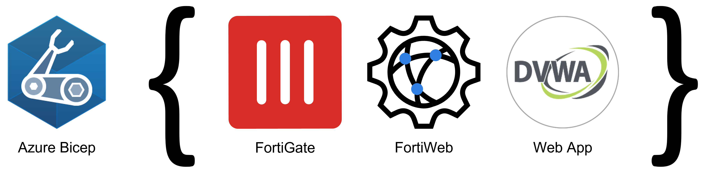
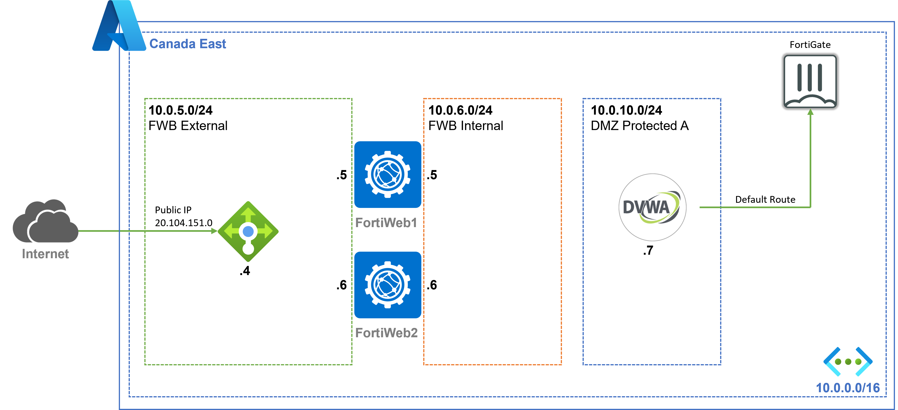

# Hands-On Lab: Fortinet Azure Blueprint

## Comparative Analysis of Azure NSG, FortiGate, and FortiWeb for Web Application Security

---

---

## Introduction

Welcome to this hands-on lab experience, designed to give you practical insights into protecting your Damn Vulnerable Web Application (DVWA). This exercise is divided into two distinct labs, each exploring different security solutions.

## Lab 1: Exploring Network Security with Azure NSG and FortiGate

In the first lab, we will explore Azure Network Security Groups (NSG) and FortiGate functionalities to establish a secure environment for your DVWA application. The aim of this section is not only to demonstrate how these tools operate and can be fine-tuned for application security, but also to highlight their limitations. By examining the differences between NSG and FortiGate, we set the stage for the second lab focused on FortiWeb, which provides a more comprehensive security solution.

### Components

- Azure Network Security Groups (NSG)
- FortiGate Firewall
- DVWA Web Application

## Lab 2: Enhancing Web Application Security with FortiWeb

The primary objective of this second lab is to introduce the various security measures available for protecting web applications. You will gain firsthand experience in implementing these tools and will have the opportunity to compare their effectiveness, with a focus on demonstrating FortiWeb's superior protection capabilities compared to previous solutions.

### Components

- FortiWeb Web Application Firewall
- DVWA Web Application

## Network topology

There are multiple ways to install **FortiGate**, **FortiWeb** and **DVWA**. In this document, we will utilize a predefined template available for Azure:

:simple-github: <a href="https://github.com/AJLab-GH/fortinetCloudBlueprint" target="_blank">The Fortinet Reference Architecture for Azure</a>

This template automatically deploys a **FortiGate** cluster, a **FortiWeb** cluster, and a **DVWA** instance, along with a predefined policy, enabling you to begin the demo immediately.

??? question "What is Fortinet Reference Architecture for Azure?"
    This architecture provides users with templates that deploy and preconfigure a perimeter solution to address dynamic security needs.

    It features a **FortiGate** Next Generation Firewall, **FortiWeb WAF**, and **DVWA** Endpoint.

    
    
    The WAF secures web servers against inbound attacks over HTTP/HTTPS, while the Next Generation Firewall supports various protocols, enabling connectivity, multi-protocol security, and serving as the primary egress mechanism. The FortiGate and FortiWeb solutions complement each other, with FortiWeb offering advanced features for HTTP/HTTPS traffic and FortiGate providing extensive capabilities for other protocols, routing, VPN termination, and SD-WAN.

??? note "Network Topology"
    This Azure BICEP template deploys a secure environment featuring **FortiGate** and **FortiWeb** for traffic inspection. The **FortiGate** setup receives non-HTTP(S) traffic, while **FortiWeb** handles HTTP(S) traffic, both using user-defined routing (UDR) and public IPs. Additionally, a **Damn Vulnerable Web Application** (DVWA) is included for security testing and learning purposes.

    The environment includes:

    - 2 x **FortiGate** Firewalls in an active/passive deployment
    - 2 x **FortiWeb** WAFs in an active/active deployment
    - 2 x Public Azure Standard **Load Balancers** for internet communication (1 x per cluster)
    - 2 x Internal Azure Standard **Load Balancers** for forwarding traffic to Azure Gateways connected to ExpressRoute or Azure VPNs
    - 1 x **VNET** with 1 protected subnet
    - 4 x **Public IPs** for services and FortiGate/FortiWeb management
    - **User Defined Routes** (UDR) for end-to-end communication via the FortiGate/FortiWeb deployment

    VMs can be installed in different **Availability Zones** or **Availability Sets** for enhanced availability.
    
    These templates can also be **extended** or **customized** based on your requirements, such as adding additional subnets and routing tables.

    Click on the image if you want to enlarge it.

    

??? note "FortiWeb Deployment"
    FortiWeb is deployed with **2 interfaces** as an **active-active** cluster in **reverse proxy mode**.

    - Web browsers connect to the public IP on Azure's Standard Load Balancers.
    - FortiWeb decrypts and inspect the HTTP traffic, then forwards it to the DVWA via its internal IP
    - Return packets are directed back to FortiWeb's internal IP.
    - For DVWA OS updates or SSH connections, traffic is routed through FortiGate.

    Click on the image if you want to enlarge it.

    
