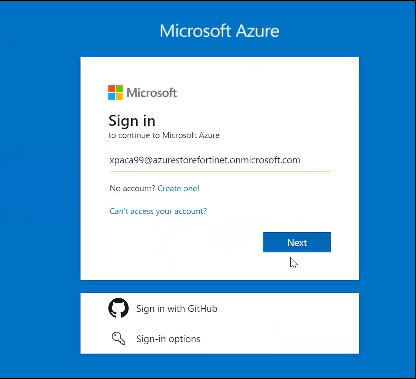
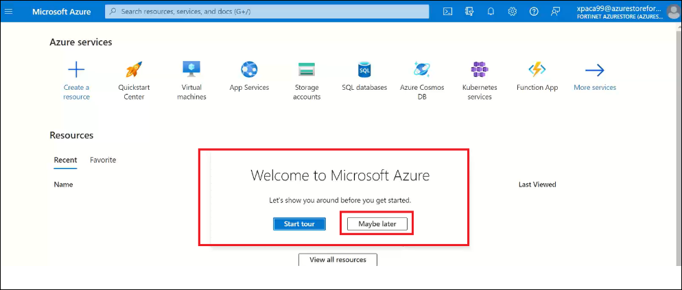
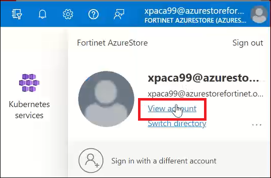
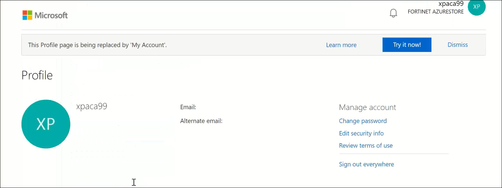
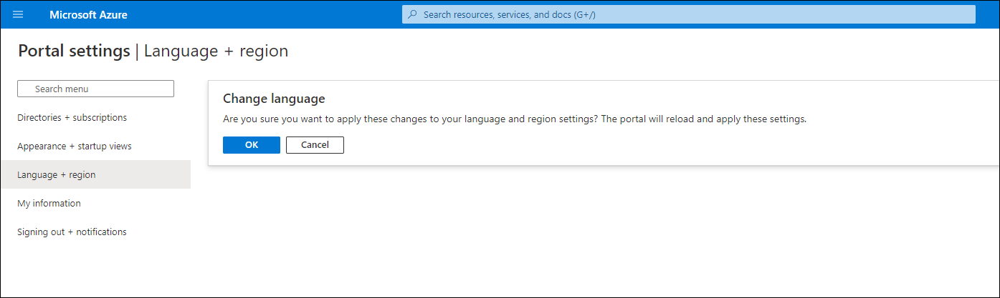
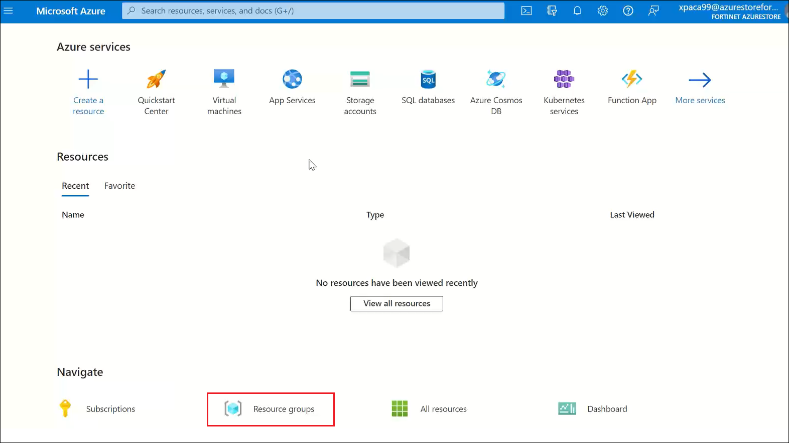

# Accessing your Azure Account

This Hands-on-Lab is configured to allow each student to have their own training lab environment using pre-created Azure resource groups, all in one shared Azure Subscription.

??? note "Accessing the Azure Portal: Login Instructions"
    ##Accessing the Azure Portal

    Browse to <a href="https://portal.azure.com" target="_blank">https://portal.azure.com</a>

    Use the credentials provided to you by your instructors.
    
    If you can't find them, check your junk mail folder. Look for an email with the subject line: **MIS - Xperts Summit - Public Cloud Track - AZURE LAB Credentials**.

    **Username**: xpaca**XX**@azurestorefortinet.onmicrosoft.com

    

    **Password**: <*password provided by email*\>

    

    Click to log in, and optionally select "Yes" to stay signed in.

    

    When the **Welcome to Microsoft Azure** window appears, skip the tour.

    

    Now that you've signed in, you are on the Azure Portal Dashboard.
    
    Notice your **username** in the top right corner.

??? note "Changing Your Password"
    ## Changing Your Password
    Click on your **username** located in the top-right corner of the screen.

    

    Select **View Account**. This action will automatically open a new tab.

    

    You can skip the Microsoft feedback in this new tab.

    

    Scroll down, if needed, and click on **Change Password**.

    

    Fill in the required fields to change your password and click **Submit**.

    

    Once you see the confirmation screen, you can close this tab. Your password has been successfully changed.

    

??? note "Switching Language Settings"
    ## Switching Language Settings

    If you wish to change the language of your Azure dashboard, follow these steps.

    After logging into your Azure account, click on the **gear icon** in the upper-right corner.

    

    Next, select **Language + Regional Format**.

    

    Choose your preferred language and regional format.

    For example, if you select “English (Canada)," it will change the Dashboard language to Canadian English.

    

    Click **Apply**. A message will appear asking for confirmation. Click **OK** to confirm the language change.

    

??? note "Verifying Resource Groups"
    ## Verifying Resource Groups

    In a new Azure subscription account, only two resource groups will be pre-existing. These will be used in this lab for security customization.

    Navigate to **Resource Groups** on the main page.

    

    Make sure **two** resource groups are displayed, prefixed with your student number.

    

??? warning "Launching CLI & Setting Up Storage Account (mandatory)"
    ## Launching CLI & Setting Up Storage Account
    
    We'll next connect to the **Azure CLI**, which plays a key role in facilitating automated deployments. To do this, you'll need to have a storage account configured.

    Click on the **CLI Icon**, found in the top-right corner.

    

    This will open the CLI Shell at the bottom of the screen. Select **Bash Shell**.

    

    Select your **FTNT-Training** subscription and click on **Show Advanced Settings**.

    

    These advanced settings allow you to select existing resources. Note that the default settings may not align with where our Resource Groups are located.

    Adjust your settings to match the example below. **Note**: Your student number may differ.

    

    You are now welcomed to the *Azure Cloud Shell*.

    

    Congratulation! You are all set to proceed with the lab activities.
