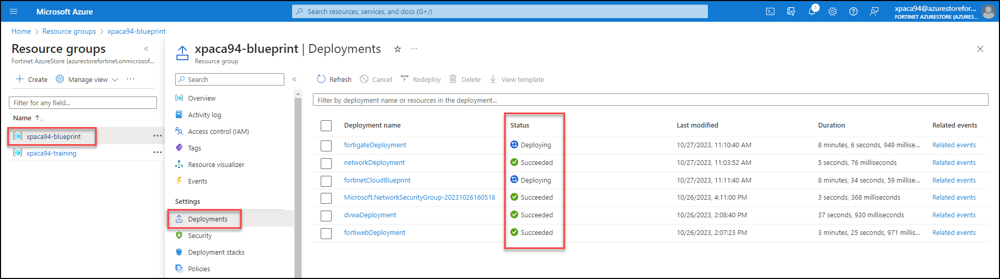
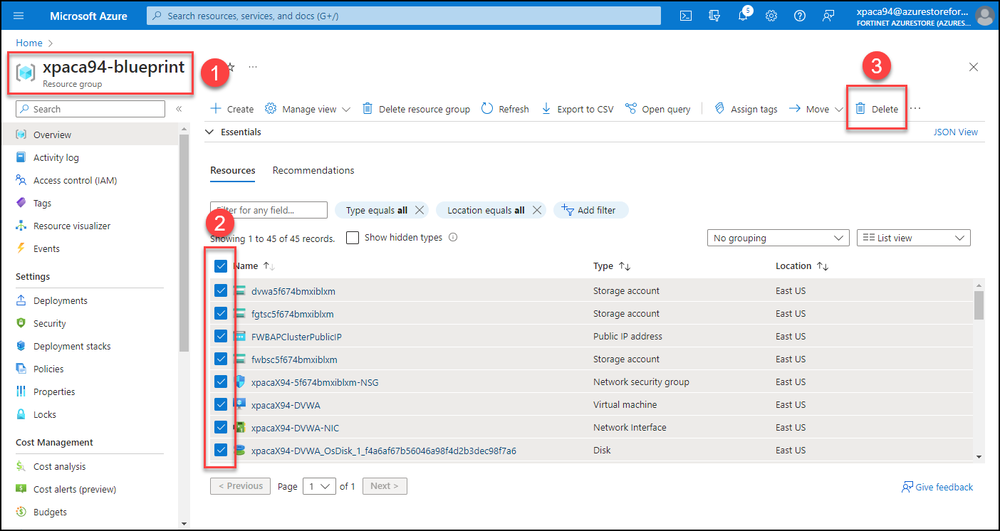
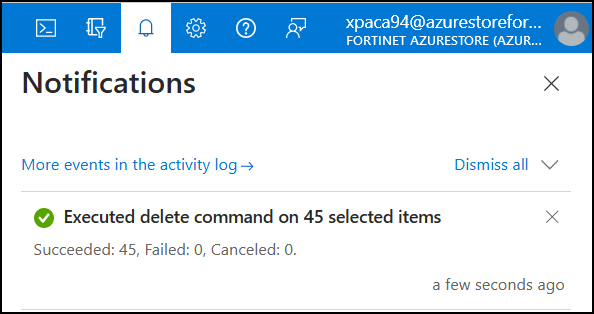

# Your Lab Environment

The accounts provided as a part of **Fortinet XPERTS Academy** have adjusted resource quotas to reflect the demands of this Hands on Lab. The subcription has also accepted the terms of the required marketplace offers.

## Deploying your Lab Environment in Azure

This section will guide you through the essential steps to deploy your Lab Environment in Azure with the <a href="https://github.com/AJLab-GH/fortinetCloudBlueprint" target="_blank">Fortinet Reference Architecture for Azure</a></center>.

!!! tip
    Click on the images to view them in a larger format.

??? note "Define your Prefix, Region and Ressource Groupe Name"

    Before you proceed, complete the form below to personalize your Hands-on Lab experience by setting your **Prefix**, **Region**, and **Resource Group Name**.

    <!-- HTML Form -->
    <form id="userInputForm" style="border: 1px solid #ccc; padding: 15px; margin: 15px;">
        <div style="display: flex; flex-direction: column; gap: 10px;">
            <label style="font-weight: bold;">Prefix:</label>
            <input type="text" id="prefix" name="prefix" value="xpacaXX" required style="border: 1px solid #ccc; padding: 5px;">
            <p>This prefix will be applied to all resources created during this lab for easier management and identification. Your prefix will be <strong>xpacaXX</strong> where <strong>XX</strong> is your student number.</p>
            <label style="font-weight: bold;">Region:</label>
            <input type="text" id="region" name="region" value="eastus" required style="border: 1px solid #ccc; padding: 5px;">
            <p><span style="color:red;">You need to choose the <strong>eastus</strong> region (Richmond, Virginia)</span> because this is where our Lab Quota is available. Outside of this HOL session, you could select any region in Canada such as <strong>canadacentral</strong> (Toronto, Ontario) or <strong>canadaeast</strong> (Quebec City, Quebec).</p>
            <label style="font-weight: bold;">Resource Group Name:</label>
            <input type="text" id="resourceGroupName" name="resourceGroupName" value="xpacaXX-blueprint" maxlength="19" required style="border: 1px solid #ccc; padding: 5px;">
            <p>This will be the name of the Azure Resource Group where all your lab resources will be contained. Your Azure Resource Group will be <strong>xpacaXX-blueprint</strong> where <strong>XX</strong> is your student number.</p>
            <input type="submit" value="Submit" style="border: 1px solid #ccc; padding: 5px;">
            <div id="confirmationMessage" style="margin-top: 10px;"></div>
        </div>
    </form>

??? note "Deploy the Lab Environment with Bicep"

    - Access the Azure Cloud Shell either through the Azure Portal or directly via <a href="https://shell.azure.com" target="_blank">https://shell.azure.com</a>.
    - Log into the Azure Cloud Shell.
    - Run the following commands in the Azure Cloud:

    ``` py
    az bicep upgrade
    git clone -b xPerts-HoL https://github.com/AJLab-GH/fortinetCloudBlueprint.git
    cd fortinetCloudBlueprint
    ```

    

    - Deploy the template

    ``` py
    az deployment group create --name fortinetCloudBlueprint --resource-group @RESOURCE_GROUP_NAME --template-file 000-main.bicep
    ```

    - When you execute the script, it will prompt you with a few questions to configure the necessary settings for deployment. You'll need to provide answers for these specific settings.

    | Parameter    | Description                                                                                                                                                             | Requirements                                                                                                                                                                         |
    |--------------|-------------------------------------------------------------------------------------------------------------------------------------------------------------------------|--------------------------------------------------------------------------------------------------------------------------------------------------------------------------------------|
    | **USERNAME** | The username you provide will grant you access to the FortiGate / FortiWeb GUI and SSH management interface. This username can differ from your Azure account username. | Username **admin** is **not** allowed.                                                                                                                                               |
    | **PASSWORD** | The password that will be used to log in to the FortiGate / FortiWeb GUI and SSH management interface. <span style="color:red;">It's crucial to use a unique password that hasn't been used elsewhere, as it will appear in plaintext in the bootstrap process.</span>                                                                  | At least 12 characters long and must include characters from at least three of the following categories: uppercase, lowercase, numbers, special characters (excluding '\\' and '-'). |
    | **PREFIX**   | Enter **@PREFIX**. It will be applied to all the resources created to make them easier to manage, use, and identify.                                                    | Needs to be **unique**.                                                                                                                                                              |
    
    - To proceed, please enter the necessary variables when prompted.

    

    - <span style="color:red;">Deployment can take up to 15 minutes. Time for a coffee break, maybe even two.</span>

    - While the template is deploying, you can monitor its progress by navigating to the resource group **@PREFIX-blueprint** and selecting the **Deployments** menu.

    
 
    - After deployment, you can output essential information such as public IP addresses that you will need to connect to your deployment:

    ``` py
    az deployment group show -g @RESOURCE_GROUP_NAME -n fortinetCloudBlueprint --query properties.outputs
    ```

    

??? note "Connect to FortiWeb"
    Once the deployment is complete, use the following **URLs** and **ports** to connect to your instances:

    | Instance  |                                                              HTTPS Ports                                                        | SSH Ports |
    |:---------:|:-------------------------------------------------------------------------------------------------------------------------------:|:---------:|
    | FWB-A     | <a href="https://@PREFIX.@REGION.cloudapp.azure.com:40030" target="_blank">https://@PREFIX.@REGION.cloudapp.azure.com:40030</a> |  50030    |
    | FWB-B     | <a href="https://@PREFIX.@REGION.cloudapp.azure.com:40031" target="_blank">https://@PREFIX.@REGION.cloudapp.azure.com:40031</a> |  50031    |
    | DVWA      |     <a href="https://@PREFIX.@REGION.cloudapp.azure.com" target="_blank">https://@PREFIX.@REGION.cloudapp.azure.com:443</a>     |   N/A     |

    !!! tip "FAQ"
        **Why is it hard to predict which FortiWeb unit will handle my traffic?**

        Traffic is distributed across both FortiWeb units, FWB-A and FWB-B. Due to this load-balancing mechanism, it's unpredictable to determine in advance which unit will manage a particular flow of traffic. That is said, we have enabled **connection persistence** on the external Azure Load Balancer. This ensures that once you've identified the correct FortiWeb unit, your traffic should consistently be managed by that unit.
        
        **What should I do if I find the traffic log empty?**

        If the traffic log is empty on one of the FortiWeb units, you'll need to log in to the other unit to see if the traffic is being managed there.
        
        **Why do I get logged out of one GUI when logging into the other?**

        Both FortiWeb units share the same domain and, consequently, the same cookies. Logging in to one GUI will overwrite the cookie for the other, automatically logging you out.
        
        **How can I stay logged into both GUIs simultaneously?**

        If you wish to keep both GUIs open at the same time, you will need to use two different web browsers. This will allow you to maintain separate sessions for each FortiWeb unit.

    You can use the az **deployment group show** command to display all resources along with their URLs and ports.

    ``` py
    az deployment group show -g @RESOURCE_GROUP_NAME -n fortinetCloudBlueprint --query properties.outputs
    ```

    

    When connecting to FortiWeb GUI, use the username and password that you provided when deploying the template. You should then be logged in to the main Dashboard.

    
    
    You can double check your **DNS configuration** in the Azure Public IP settings.

    In the Azure portal, search for **FWBAPClusterPublicIP**.

    
    
    You will find the DNS configuration under the configuration menu.

    

??? note "Ensure that your environment is operational"
    Ensure your environment is set up correctly by following this three-step checklist.

    1 - You should be able to navigate to the DVWA application: <a href="https://@PREFIX.@REGION.cloudapp.azure.com" target="_blank">https://@PREFIX.@REGION.cloudapp.azure.com</a>

    **If you encounter a FortiWeb block page, clear your browser cache and try again.**

    

    2 - Verify the presence of the two FortiWeb instances on the main dashboard by navigating to `Dashboard > Status`. Additionally, check the status of your license. **Note**: we are using PAYG License model for this Lab.

    

    3 - Verify the topology by going to the menu `Dashboard > FortiView Topology`

    

    If you encounter any issues, refer to the following troubleshooting sections or consult your instructor.

??? tip "Troubleshooting - What to do if the cluster is not operational?"
    During the initial startup, there's a possibility that **ARP on port2** may malfunction, which could render the cluster inoperative, as port2 is deemed faulty. In such cases, you'll need to restart both FortiWeb VMs via the Azure console.

    **Note that restarting the FortiWebs from the GUI will not resolve the ARP issue; only a restart from the Azure portal will fix it.**

    Navigate to the **Virtual Machines** menu in the Azure portal. Select the two FortiWeb VMs and click on **Restart**.

    

??? tip "Troubleshooting - What to do if there is no policy in place, or if DVWA is not accessible?"
    The FortiWeb configuration, including the WAF policy, is automatically loaded when the VM is created. We achieve this by using the Azure **cloud-init** feature. Cloud-init is a widely used method for customizing a VM as it boots for the first time. However, there may be circumstances where the configuration doesn't load correctly. If this happens to you, you can simply manually import our configuration file.

    1 - Navigate to the [bootstrap page](bootstrap.md)

    2 - Copy **Part 2** of the configuration to your clipboard

    

    3 - Connect to <a href="https://@PREFIX.@REGION.cloudapp.azure.com:40030" target="_blank">your **FortiWeb** instance</a>, and open the CLI console located in the upper left corner

    4 - Paste the copied configuration into the console

    

    5 - Navigate to `Dashboard > FortiView Topology` and verify that the policy is now displayed

    

    6 - You should be able to navigate to the DVWA application: <a href="https://@PREFIX.@REGION.cloudapp.azure.com" target="_blank">https://@PREFIX.@REGION.cloudapp.azure.com</a>

    

??? tip "Troubleshooting - Delete and rebuild your Lab Environment"
    Here's the process to follow if you need to delete and rebuild your Lab environment:

    <span style="color:red;">Do not delete the resource group itself, as you won't be able to recreate it.</span>

    - Navigate to the Azure portal
    - Choose your resource group, identified as **@RESOURCE_GROUP_NAME**
    - Select all the resources within the group
    - Click on **Delete**

    

    - Opt for **Apply force delete for selected Virtual machines and Virtual machine scale sets**
    - Type **delete** to confirm deletion
    - Click on **Delete**

    

    - Wait for the deletion process to complete

    

    - Navigate to <a href="https://shell.azure.com" target="_blank">Azure Cloud Shell</a> and make sure you are in the **fortinetCloudBlueprint** folder

    ``` py
    cd fortinetCloudBlueprint
    ```

    - Redeploy the template using the following command
  
    ``` py
    az deployment group create --name fortinetCloudBlueprint --resource-group @RESOURCE_GROUP_NAME --template-file 000-main.bicep
    ```

??? note "Check your System Configuration (optional)"
    Once you have access to the FortiWeb GUI, those are the main menu to check your system configuration.

    | Configuration                 | Menu                                                |
    |:------------------------------|:----------------------------------------------------|
    | FortiWeb Network Access       | `Network > Interface`                               |
    | Routing                       | `Network > Static Route`                            |
    | DNS Configuration             | `Network > DNS`                                     |
    | VM License                    | `Dashboard > Status > Licenses > Update VM License` |
    | FortiGuard Status and Updates | `System > Config > FortiGuard`                      |
    | Time Zone Setting             | `System > Maintenance > System Time`                |
    | Timeout Setting               | `System > Admin > Settings > Idle Timeout`          |
    | Firmware Version              | `System > Maintenance > Firmware`                   |

??? note "Check your Application Policy (optional)"
    During the Bicep deployment, we imported this [bootstrap](bootstrap.md). Those are the main menus to check your Application Policy:

    | Configuration          | Menu                                          |
    |:-----------------------|:----------------------------------------------|
    | Virtual IP             | `Network > Virtual IP`                        |
    | Virtual Server         | `Server Objects > Virtual Server`             |
    | Server Pool            | `Server Objects > Server Pool`                |
    | Signature              | `Web Protection > Known Attacks > Signatures` |
    | Web Protection Profile | `Policy > Web Protection Profile`             |
    | Policy                 | `Policy > Server Policy`                      |

## Initializing DVWA

??? note "Initialize DVWA database and authenticate"
    Connect to <a href="https://@PREFIX.@REGION.cloudapp.azure.com/setup.php" target="_blank">https://@PREFIX.@REGION.cloudapp.azure.com/setup.php</a>

    Click **Create / Reset Database**

    

    Click **Login** and authenticate with any of these accounts:

    | Username | Password |
    |:---------|:---------|
    | admin    | password |
    | gordonb  | abc123   |
    | 1337     | charley  |
    | pablo    | letmein  |
    | smithy   | password |

    You should be directed to the welcome page.

    


??? question "How to install DVWA in another Lab Environement?"
    If you are not using the :simple-github: <a href="https://github.com/AJLab-GH/fortinetCloudBlueprint" target="_blank">Azure Fortinet Cloud Blueprint</a>, you can install your own DVWA instance.

    The most straightforward way to install DVWA is by utilizing Docker. Install any Linux distribution with Docker and run those 2 commands:

    ``` py
    sudo docker pull vulnerables/web-dvwa
    sudo docker run -d --restart unless-stopped -p 80:80 vulnerables/web-dvwa
    ```

    You can explore additional deployment options on the official :simple-github: <a href="https://github.com/digininja/DVWA" target="_blank">DVWA GitHub</a>.


<!--
- Create a resource group for your deployment:

``` py
az group create --location @REGION --name @RESOURCE_GROUP_NAME
```


-->